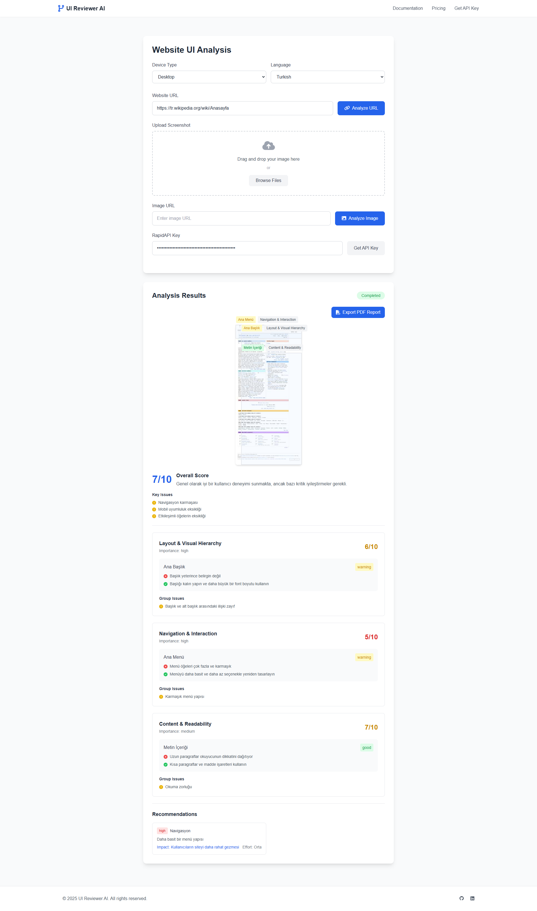

# AI Website UI Design Reviewer



A modern web application that analyzes website UI/UX design using AI technology. This tool provides comprehensive analysis and recommendations for improving website designs.

## Features

- **Multiple Analysis Methods**:
  - Website URL Analysis
  - Image URL Analysis
  - Screenshot Upload Analysis

- **Comprehensive Analysis**:
  - Layout & Visual Hierarchy
  - Navigation & Interaction
  - Content & Readability
  - Performance & Loading
  - Accessibility Features

- **Smart Features**:
  - Automatic Language Detection
  - Device Type Selection (Desktop/Mobile)
  - State Persistence in URL
  - Drag & Drop Image Upload
  - Real-time Image Preview

## Technologies Used

- HTML5
- Tailwind CSS
- DaisyUI
- Font Awesome Icons
- RapidAPI Integration

## Getting Started

1. Clone the repository:
```bash
git clone https://github.com/smtkuo/ai-website-design-ui-ux-reviewer.git
cd ai-website-design-ui-ux-reviewer
```

2. Open `index.html` in your browser or use a local server:
```bash
# Using Python
python -m http.server 8000

# Using Node.js
npx serve
```

3. Get your API Key:
   - Visit [RapidAPI](https://rapidapi.com/bilgisamapi-api2/api/ai-website-design-checker-ui-ux-analysis-tool)
   - Subscribe to get your API key
   - Enter the API key in the application

## Usage

### Analyzing a Website URL
1. Select your preferred device type (Desktop/Mobile)
2. Choose your language
3. Enter the website URL
4. Enter your RapidAPI key
5. Click "Analyze URL"

### Analyzing an Image
1. Either:
   - Upload an image using drag & drop
   - Upload an image using the file browser
   - Enter an image URL
2. Enter your RapidAPI key
3. Click "Analyze"

### Understanding Results
The analysis provides:
- Overall Score
- Key Issues
- Detailed Analysis by Category
- Specific Recommendations
- Priority Levels for Issues

## Features in Detail

### Analysis Categories
- Layout & Visual Hierarchy
- Navigation & Interaction
- Content & Readability
- Performance & Loading
- Accessibility Features

### Result Metrics
- Scores (0-10 scale)
- Status Indicators (Good, Warning, Critical)
- Priority Levels (High, Medium, Low)
- Impact Assessment
- Effort Estimation

## API Integration

The application uses the AI Website Design Checker API from RapidAPI. Endpoints used:
- `/analyze` - For all types of analysis (URL, Image URL, Image Upload)

## State Management

The application maintains state using URL hash:
- All form inputs are preserved
- Analysis results are cached
- Image previews are saved
- Settings are remembered